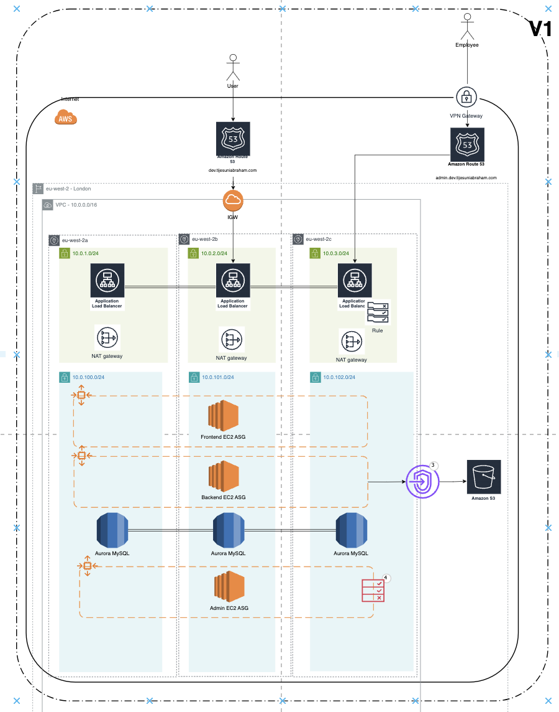

# Getting Started with Health Infrastructure

Welcome to the Health Infrastructure documentation. This project is designed to manage and provision the infrastructure necessary for supporting the `health_api`, `health_web`, and `health_admin` services. The infrastructure is built using Terraform and spans multiple layers to ensure separation of concerns and manageability.

## Overview

The Health Infrastructure is composed of various layers, each responsible for a different aspect of the cloud environment. These layers are managed through Terraform and are structured as follows:

- **000-global**: Contains resources that are shared across all environments, like Route53 Hosted Zones and shared IAM roles.
- **010-networking**: Manages all networking-related resources such as VPCs, subnets, and internet gateways.
- **020-compute**: Handles the configuration of compute resources, including EC2 instances and auto-scaling groups.
- **040-database**: Sets up and configures databases required by the platform.
- **050-storage**: Manages storage resources like S3 buckets and EBS volumes.
- 
Each layer is encapsulated in its own directory within the Terraform project, and they are applied independently to allow for modular upgrades and changes.

### Placeholder for Diagram



## Project Structure

The repository is structured into several directories, each corresponding to a specific layer of infrastructure. Here’s a brief overview of the directory structure:

```
health_infrastructure/
├── 000-global/
├── 010-networking/
├── 020-compute/
├── 040-database/
├── 040-storage/
└── docs/
    └── 001-getting_started.md
```
